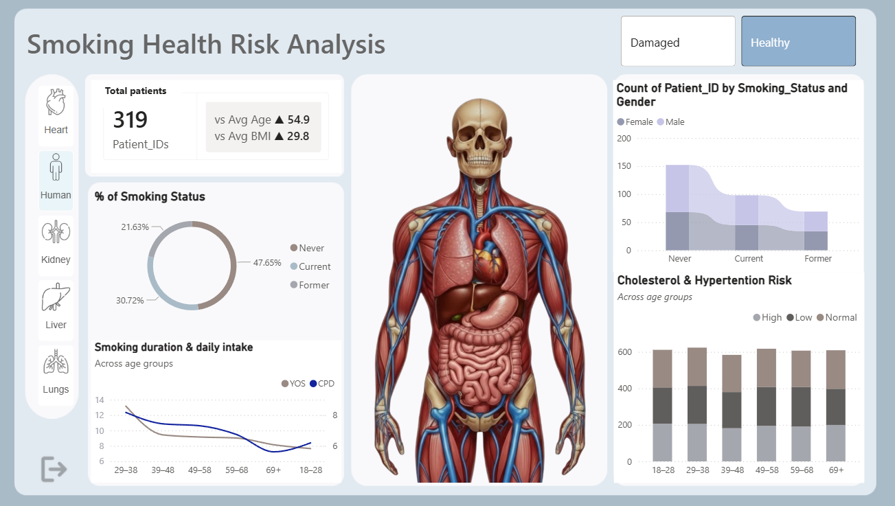
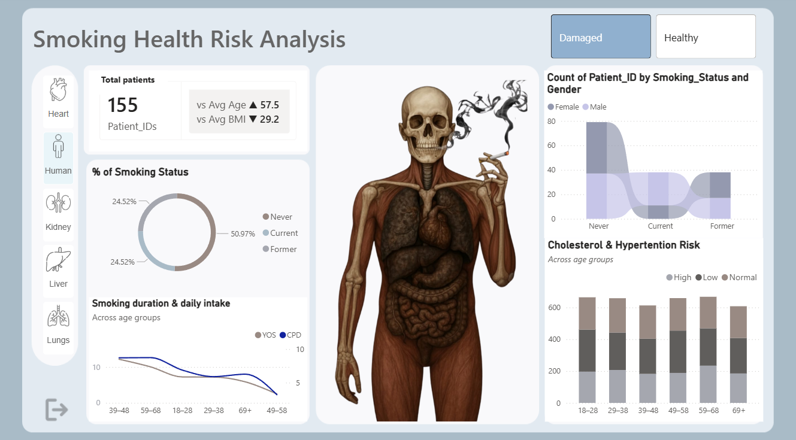
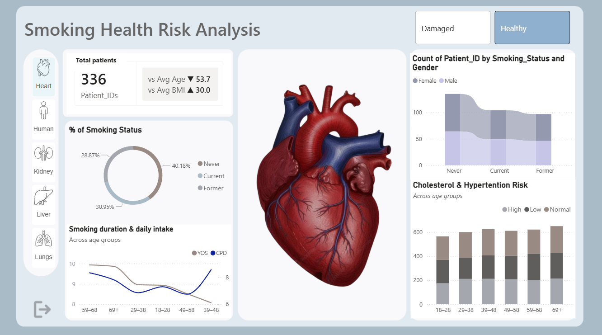
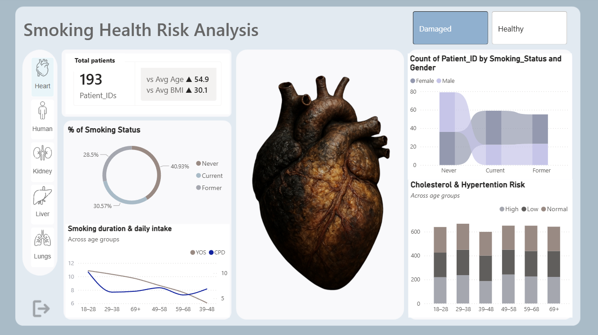
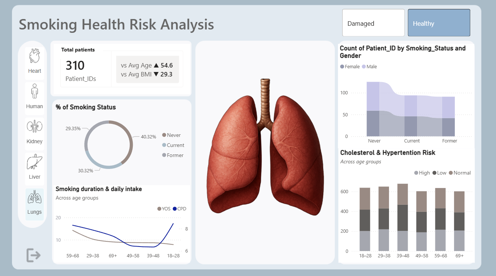
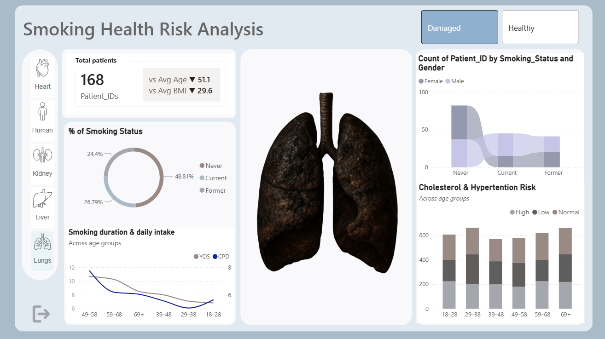
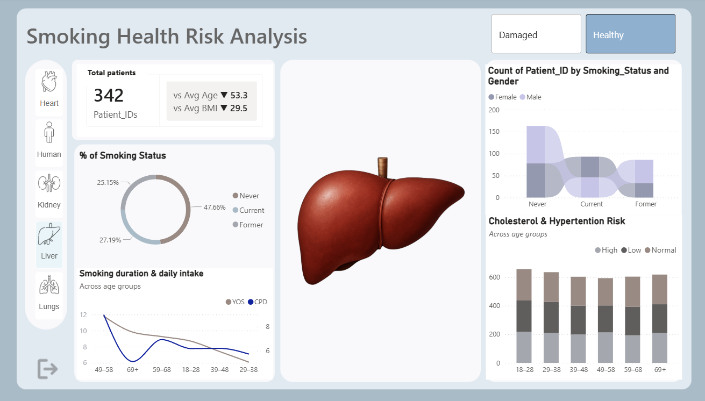
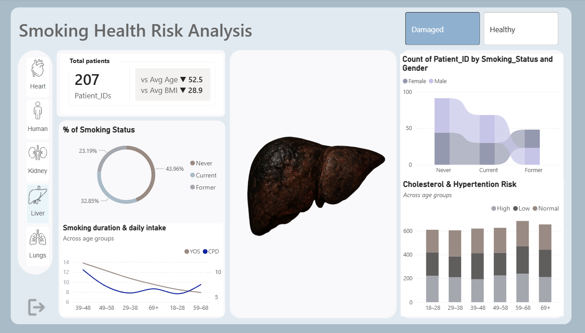
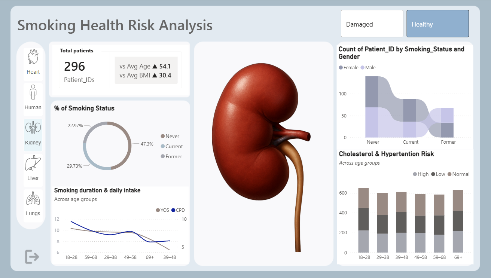
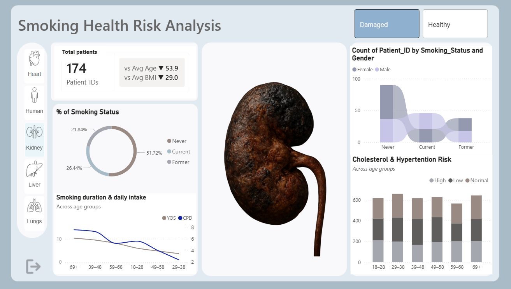

# Smoking-Health-Risk-Analysis-Power-BI-
Analysis of Smoking health risk in different organs using Power BI

 **Human Body**     
 **Heart**     
 **Lungs**     
 **Liver**     
 **Kidney**     

